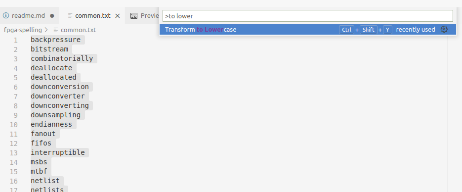
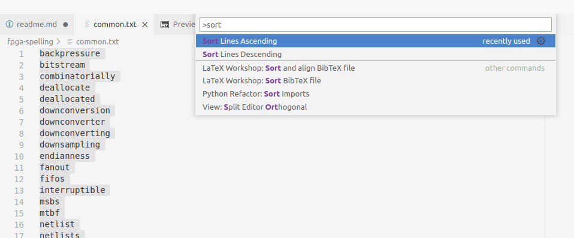

# FPGA spell checking dictionary

Dictionary with common FPGA terms, to be used with spell checking software.


## Contents

### axi.txt

Contains terms from the AMBA AXI standard.
For example `RVALID`, `ARLOCK`, etc.

### axi_stream.txt

Contains terms from the AMBA AXI-Stream standard.
For example `TVALID`, `TDATA`, etc.

### common.txt

Contains common FPGA terms.
For example `backpressure`, `FIFOs`, etc.

### electrical.txt

Contains some electrical engineering terms that are commonly encountered when doing
FPGA development. For example `LEDs`, `pullup`, etc.

### other.txt

Contains some other terms that are not strictly FPGA related, but are commonly encountered in
FPGA projects. For example `pylint`, `barebone`, etc.

### tools.txt

Contains some terms related to FPGA tools.
For example `Modelsim`, `VUnit`, etc.

### vhdl.txt

Contains terms related to the VHDL language.
For example `inout`, `sfixed`, etc.

### xilinx.txt

Contains terms related to Xilinx technology.
For example `Vivado`, `URAM`, etc.


## Usage

This project is intended for use with the [CSpell spell checker for code](https://cspell.org/),
specifically its
[Visual Studio Code extension](https://marketplace.visualstudio.com/items?itemName=streetsidesoftware.code-spell-checker).
Although it can probably be used with a lot of other tools as well.


### VSCode extension instructions

With the extension installed and this repo cloned,
add the following to your settings JSON (workspace or user settings):

```json
"settings": {
    "cSpell.customDictionaries": {
        "fpga-spelling-axi": {
            "path": "${workspaceFolder}/../../fpga-spelling/fpga-spelling/axi.txt"
        },
        "fpga-spelling-axi-stream": {
            "path": "${workspaceFolder}/../../fpga-spelling/fpga-spelling/axi_stream.txt"
        },
        "fpga-spelling-common": {
            "path": "${workspaceFolder}/../../fpga-spelling/fpga-spelling/common.txt"
        },
        "fpga-spelling-electrical": {
            "path": "${workspaceFolder}/../../fpga-spelling/fpga-spelling/electrical.txt"
        },
        "fpga-spelling-other": {
            "path": "${workspaceFolder}/../../fpga-spelling/fpga-spelling/other.txt"
        },
        "fpga-spelling-tools": {
            "path": "${workspaceFolder}/../../fpga-spelling/fpga-spelling/tools.txt"
        },
        "fpga-spelling-vhdl": {
            "path": "${workspaceFolder}/../../fpga-spelling/fpga-spelling/vhdl.txt"
        },
        "fpga-spelling-xilinx": {
            "path": "${workspaceFolder}/../../fpga-spelling/fpga-spelling/xilinx.txt"
        },
    },
    "cSpell.enableFiletypes": [
        "json",
        "md",
        "rst",
        "toml",
        "vhdl"
    ],
},
```

Note that you might have to modify the paths depending on your repository/workspace structure.

At this point are free to exclude dictionaries.
If you for example don't want the VHDL or "other" terms,
then those entries can simply be removed from the JSON.

Also the list of file types that should be checked can be modified freely.


## Additions/contributions

Contributions and additions are very welcome.
Add the word(s) that you are missing to the appropriate `.txt` file and create a pull request here
on github.

In order to keep everything in order, words shall be in all lowercase, and sorted alphabetically.
In VSCode you can select everything (Ctrl-A) and use the `Transform to lowercase` and
`Sort lines ascending` commands:




